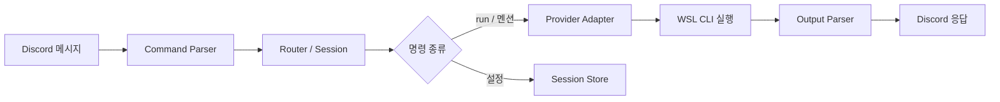

# discord-cli-bridge

> 디스코드 채널에서 `codex`/`claude` CLI를 WSL 로컬 프로젝트와 연결해 실행하는 브리지

[English](README.md) | [한국어](README.ko.md)

## 주요 특징

- **3가지 입력 방식** — 슬래시(`/run`), 텍스트(`!run`), 멘션(`@bot 프롬프트`) 모두 지원
- **채널별 세션** — 채널마다 provider/model/reasoning/CLI 세션을 독립 관리
- **멀티 프로바이더** — `/provider`로 Codex ↔ Claude 즉시 전환
- **승인 워크플로우** — 비 오너는 승인 필요, 오너는 즉시 실행
- **워크스페이스 격리** — 채널을 특정 프로젝트 디렉터리에 고정 매핑

## 빠른 시작

### 요구사항

- Node.js 22+
- pnpm
- Discord Bot Token
- `codex` 또는 `claude` CLI가 PATH에 설치

### 설치 및 설정

```bash
# 의존성 설치
pnpm install

# 설정 파일 생성
cp config/projects.example.yml config/projects.yml

# 환경변수 설정
export DISCORD_BOT_TOKEN="YOUR_DISCORD_BOT_TOKEN"
export BRIDGE_WORKSPACE_ROOT="/path/to/your/workspaces"  # 선택, 실행 경로 제한
```

`config/projects.yml`을 본인 환경에 맞게 수정:

```yaml
owner:
  discordUserId: "YOUR_OWNER_DISCORD_USER_ID"

defaults:
  provider: codex
  model: default
  models:
    codex:
      - gpt-5.3-codex
      - default
    claude:
      - default
  approvalTtlSec: 600
  runTimeoutMs: 600000

projects:
  - alias: my-studio
    path: /path/to/your/workspaces/my-studio
    provider: codex
    model: default

bindings:
  - guildId: "YOUR_GUILD_ID"
    channelId: "YOUR_CHANNEL_ID"
    project: my-studio
```

### 실행

```bash
pnpm run start     # 단일 실행
pnpm run dev       # 워치 모드
```

정상 기동 시: `Bridge online as ...` / `Registered ... slash commands for guild ...` 로그 출력

## 명령어 레퍼런스

### 정보 / 상태

| 명령 | 설명 | 예시 |
|---|---|---|
| `/help` `!help` | 사용 가능한 명령어 표시 | |
| `/status` `!status` | 현재 세션 상태 | `@bot status`, `@bot 상태` |
| `/models` `!models` | 사용 가능한 모델 목록 | `@bot models` |

### 실행

| 명령 | 설명 | 예시 |
|---|---|---|
| `/run <prompt>` `!run <prompt>` | 프롬프트 실행 | `/run 로그인 버그 수정해` |
| `@bot <prompt>` | 멘션으로 실행 | `@bot 유닛 테스트 추가해` |
| `!run --provider claude <prompt>` | 이번 실행만 provider 오버라이드 | |

### 설정 (오너 전용)

| 명령 | 설명 | 예시 |
|---|---|---|
| `/provider <codex\|claude>` | Provider 전환 | `/provider claude` |
| `/model <model>` | 모델 설정 | `!model gpt-5.3-codex --reasoning xhigh` |
| `/new` | 현재 provider 세션 초기화 | |
| `/approve <id>` | 대기 중인 요청 승인 | |
| `/deny <id>` | 대기 중인 요청 거부 | |

> **참고:** Reasoning 레벨(`low`, `medium`, `high`, `xhigh`)은 Codex만 지원. Claude는 세션에 값을 저장하지만 실행 시 무시됩니다.

## 설정 가이드

### 채널 바인딩

채널은 `config/projects.yml`의 `bindings`에 명시적으로 매핑해야 합니다. 미매핑 채널은 거부됩니다.

```yaml
bindings:
  - guildId: "111111111111111111"
    channelId: "222222222222222222"
    project: my-studio
```

### 숏컷 등록

`config/projects.yml`에 별칭을 추가하면 텍스트/멘션에서 바로 사용 가능:

```yaml
shortcuts:
  s: status
  m: model
  n: new
  ml: models
  상태: status
```

## 아키텍처



주요 컴포넌트:

- **명령 라우팅 & 오케스트레이션** — `src/discord-bot.ts`
- **Provider 어댑터 인터페이스** — `src/runner/providers/provider-adapter.ts`
- **Provider 구현체** — `codex-adapter.ts`, `claude-adapter.ts`
- **출력 파싱** — `src/runner/output.ts` (JSON/JSONL 추출)
- **세션 영속화** — `src/storage/session-store.ts`
- **승인 워크플로우** — `src/storage/approval-store.ts`

## 보안 권장사항

- Bot token은 `DISCORD_BOT_TOKEN` 환경변수 사용 — 코드에 하드코딩 금지
- `config/projects.yml`은 gitignore 대상 — 로컬 전용 매핑 포함
- `BRIDGE_WORKSPACE_ROOT` 설정으로 실행 경로 제한

## 트러블슈팅

### 슬래시 명령이 "Unknown command"로 표시될 때

- 텍스트 명령으로 먼저 확인 (`!status`, `!models`)
- 슬래시 명령은 재시작 후 등록까지 수십 초 소요될 수 있음
- 기동 로그에서 `Registered ... slash commands ...` 확인

### 모델 관련 오류

- 정확한 모델명 사용 (예: `gpt-5.3-codex`)

## 라이선스

MIT
